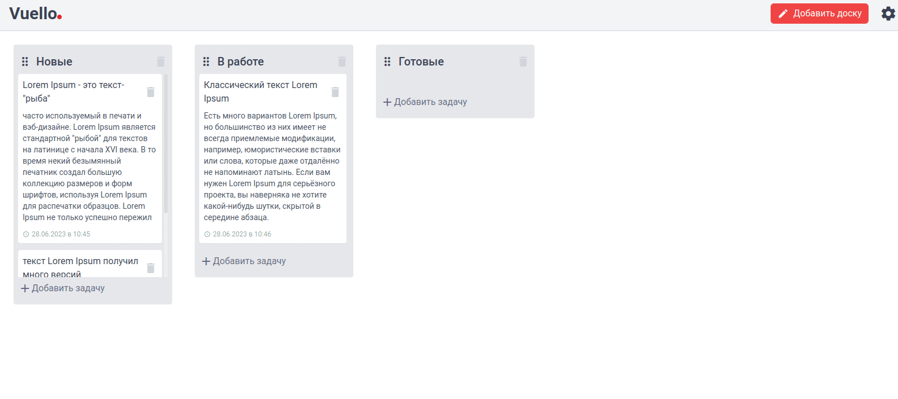
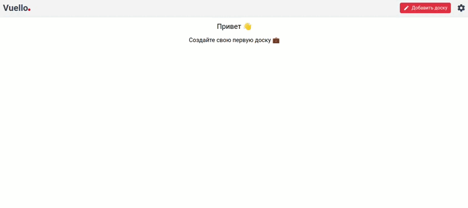

<h1 align="center">Vuello.</h1>


<h2 align="center"><a  href="https://aleksey-br.github.io/vue-trello/">Live Demo</a></h2>

## Описание

---

<p align="center">
</p>

Таск-менеджер реализован на Vue3 (composition API) c использованием Vuex. Для взаимодействия с досками и задачами используется библиотека [Vue Smooth DnD](https://github.com/kutlugsahin/vue-smooth-dnd/). Для хранения используется LocaleStorage.

#### Возможеости:

- Создавать / Удалять доски,
- Создавать / Удалять задачи,
- В разработке:
  - Редактирование наименования досок,
  - Редактирование информации о задаче,
  - Возможность визуального изменения рабочей области.

<br>

## настройка проекта

---

```
git clone https://github.com/aleksey-br/vue-trello.git

npm install
```

### Запуск проекта для разработки

```
npm run serve
```

### Сборка проекта

```
npm run build
```

### Customize configuration

See [Configuration Reference](https://cli.vuejs.org/config/).
